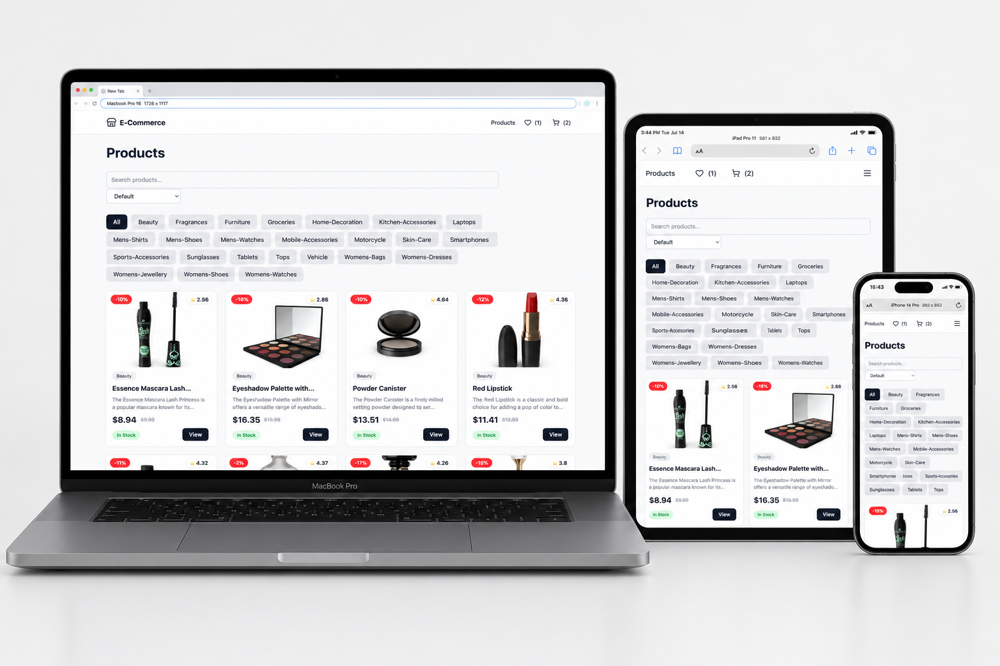
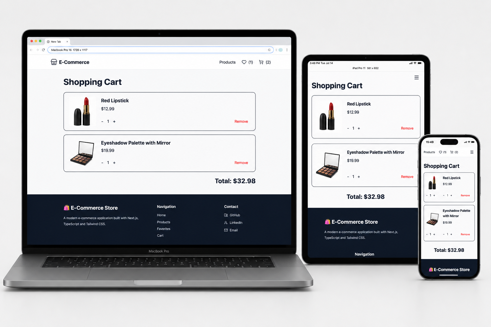

# 🛍️ E-Commerce Store

A modern, responsive e-commerce web application built with **Next.js 16**, **React 19**, **TypeScript**, and **Tailwind CSS v4**.

The application allows users to browse products, search, filter, sort, manage favorites, add items to the shopping cart, and switch between light and dark themes.

---

## 🌐 Live Demo

> https://e-commerce-mshchebetiuk.netlify.app/

---

## ✨ Features

- 🛍 Browse products
- 📄 Product details page
- 🔍 Search products
- 🏷 Filter by category
- ↕️ Sort products
- 📄 Pagination
- 🛒 Shopping cart
- ❤️ Favorites
- 🌙 Dark / Light mode
- 📱 Fully responsive design
- ⌛ Loading skeletons
- ⚠️ Error handling
- 📭 Empty states
- 🔔 Toast notifications
- 💾 Local Storage persistence

---

## 🛠 Tech Stack

### Frontend

- Next.js 16 (App Router)
- React 19
- TypeScript
- Tailwind CSS v4

### State Management

- Context API

### Libraries

- Axios
- next-themes
- Lucide React
- Sonner

### API

- DummyJSON API

---

## 📂 Project Structure

```text
src/
│
├── app/
├── components/
├── context/
├── hooks/
├── services/
├── types/
├── utils/
└── lib/
```

---

## 📸 Screenshots

### 🏠 Home


### 🛍 Products


### 📄 Product Details



### 🛒 Shopping Cart



### ❤️ Favorites


---

## 🚀 Getting Started

### Clone the repository

```bash
git clone https://github.com/mshchebetiuk/ecommerce-store.git
```

### Install dependencies

```bash
npm install
```

### Run development server

```bash
npm run dev
```

Open your browser:

```text
http://localhost:3000
```

---

## 📦 Build

```bash
npm run build
```

---

## 🧹 Lint

```bash
npm run lint
```

---

## 📱 Responsive Design

- ✅ Mobile
- ✅ Tablet
- ✅ Desktop

---

## ♿ Accessibility

- Semantic HTML
- Keyboard navigation
- aria-label support
- Responsive layout

---

## 📈 Future Improvements

- Authentication
- User Profile
- Checkout
- Order History
- Product Reviews
- Product Gallery
- Unit Testing
- End-to-End Testing

---

## 👨‍💻 Author

**Maksym Shchebetiuk**

- GitHub: https://github.com/mshchebetiuk
- LinkedIn: https://www.linkedin.com/in/maksym-shchebetiuk-bb53102a0/
- Email: its.mshchebetiuk@gmail.com

---

## 📄 License

This project is intended for educational and portfolio purposes.